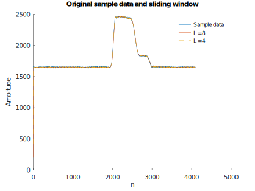
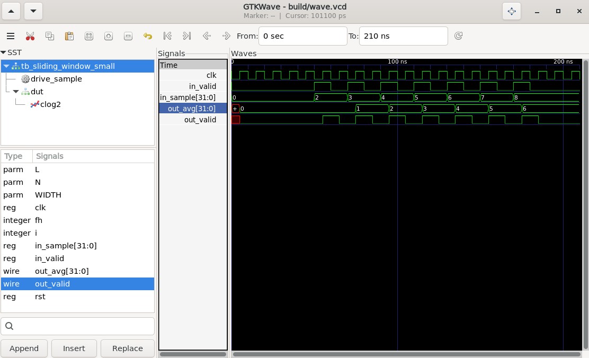
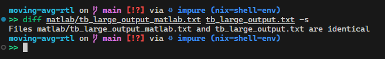
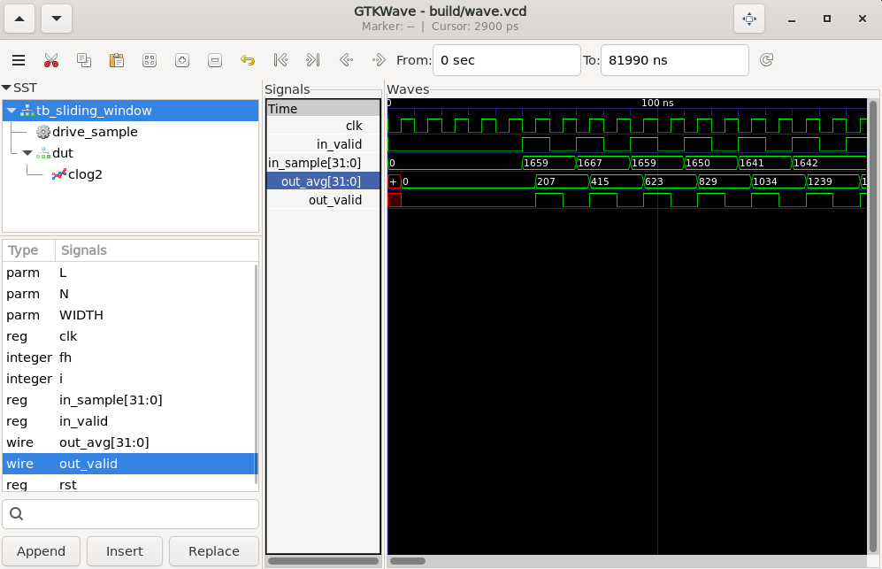


**Project Repository**

[github.com/chxpdotdev/moving-avg-rtl](https://github.com/chxpdotdev/moving-avg-rtl)



The goal of this project is to implement a datapath in Verilog and calculate the moving average of a signal with a sliding window of length `L`, and run it on a [Nexys A7-100T FPGA](https://digilent.com/reference/programmable-logic/nexys-a7/start). The datapath will be compared to an implementation on Matlab/Octave. Originally, this project was done on Xilinx Vivado, but I wanted to experiment on designing an open-source flow that can be run anywhere using [Nix](https://nixos.org/).

## Background

The sliding window algorithm computes the average from a length of data that is defined by a window length, `L`. The output of the algorithm for each input sample is the average over the window of the current sample and the `L-1` previous samples.

For example, with an sliding window of `L = 8`, you will have an equation like so: `y[n] = (x[n] + x[n-1] + ... + x[n-7]) / 8`.

In the datapath, an input of various samples will have to be used. The output of the datapath testbench should result in a text file like so:

```
Input: 000000111101 | Output: 000000000000
Input: 000001000010 | Output: 000000000000
Input: 000000010111 | Output: 000000000000
Input: 000001001001 | Output: 000000000000
Input: 000001101100 | Output: 000000000000
Input: 000001000111 | Output: 000000000000
Input: 000001011110 | Output: 100101010100
Input: 000001000010 | Output: 001111110000
Input: 000001111110 | Output: 101111101100
```

## Matlab/Octave

[GNU Octave](https://octave.org/) has a largely Matlab-compatible language. In this project, the Matlab code can be dropped into Octave with no issues.

The input data we get is a `.mat` file, containing the structure `sample_data`. Before we do anything, we need to first convert it to a `.mem` file so we can use the input data with out datapath testbench.

```matlab
% Import data
load("input.mat", 'sample_data');

% ----------- Save as .mem file ------------ %

% two's complement bit pattern
i32_sample_data = int32(int16(sample_data(:))); 
u32_sample_data = typecast(i32_sample_data, 'uint32');

fid = fopen('input_data.mem','w');

for k = 1:numel(u32_sample_data)
    % 8 hex digits per line
    fprintf(fid, '%08X\n', u32_sample_data(k));
end

fclose(fid);
```

The `input_data.mem` file looks something like this:
```
0000067B
00000683
0000067B
00000672
...
```

Here is the equation mentioned before, but implemented recursively:

```matlab
% Performs sliding window (moving avg) recursively
function y = sliding_window(x, L)
    x = x(:);
    N = numel(x);
    y = zeros(N, 1);
    y(1) = x(1) / L;

    for n = 2 : N
        x_n_L = 0;
        if n - L >= 1, x_n_L = x(n - L); end
        y(n) = y(n - 1) + (x(n) - x_n_L) / L;
    end
end
```

We can then run the function for different window lengths. The following is a plot of the sample data and output data when the lengths are 8 and 4.



The plot shows how the output data waveforms are a little filtered or smoothened compared to the raw sample data.

The matlab code also outputs a text file, which we can use to compare with the Verilog datapath. Here are the first few lines:

```
Input: 00000000000000000000011001111011 | Output: 00000000000000000000000011001111
Input: 00000000000000000000011010000011 | Output: 00000000000000000000000110011111
Input: 00000000000000000000011001111011 | Output: 00000000000000000000001001101111
Input: 00000000000000000000011001110010 | Output: 00000000000000000000001100111101
Input: 00000000000000000000011001101001 | Output: 00000000000000000000010000001010
```

## Verilog Simulation Software

As the point of this project is to use FOSS tools, the simulator isn't vivado.

### [Icarus Verilog](https://github.com/steveicarus/iverilog) (iverilog)
This is our Verilog compiler. It compiles the RTL + testbench into a simulation executable (`.vvp`).

### vvp
The runtime for Icarus Verilog. This runs the `.vvp` bytecode, and dumps data and waveforms.

### [gtkwave](https://gtkwave.sourceforge.net/)
The waveform viewer. This allows me to inspect the waveforms.

## Verilog Datapath Simulation

The Verilog datapath was implemented non-recursively and parametrically. The full code is [here](https://github.com/chxpdotdev/moving-avg-rtl/blob/main/src/sliding_window.v).

### Test Simulation

As for the simulation testbench, we need to first implement something small that tests our code, without having to use the large input data. We can test 7 samples (2, 3, 4, 5, 6, 8).

Our clock will be running at 100MHz. Here is the instantiated DUT:

```verilog
sliding_window #(
    .WIDTH(WIDTH),
    .L(L)
) dut (
    .clk       (clk),
    .rst       (rst),
    .in_valid  (in_valid),
    .in_sample (in_sample),
    .out_valid (out_valid),
    .out_avg   (out_avg)
);
```

We also need to manually dump data for our waveforms as we aren't using Vivado.

```verilog
// Waveform dump
initial begin
    if (!$test$plusargs("NOVCD")) begin
    $dumpfile("build/wave.vcd");               // make sure 'build/' exists
    $dumpvars(0, tb_sliding_window_small);     // dump whole TB hierarchy
    end
end
```

The full code can be found [here](https://github.com/chxpdotdev/moving-avg-rtl/blob/main/tb/tb_sliding_window_small.v).

#### Results

Here is the outputted text file:
```
Input: 00000000000000000000000000000010 | Output: 00000000000000000000000000000000
Input: 00000000000000000000000000000011 | Output: 00000000000000000000000000000001
Input: 00000000000000000000000000000100 | Output: 00000000000000000000000000000010
Input: 00000000000000000000000000000101 | Output: 00000000000000000000000000000011
Input: 00000000000000000000000000000110 | Output: 00000000000000000000000000000100
Input: 00000000000000000000000000000111 | Output: 00000000000000000000000000000101
Input: 00000000000000000000000000001000 | Output: 00000000000000000000000000000110
```

We can compare the data with the waveform:




**Note**

The waveforms and output data are all in decimal. There is no fixed-point or floating-point implemented here, so all the fractional parts are truncated.


### Full Simulation

In our actual simulation, we will read in the `.mem` file outputted by the Matlab code into a ROM:

```verilog
reg signed [WIDTH-1:0] rom [0:N-1];

initial begin
    $readmemh("./tb/input_data.mem", rom);

    // Waveform dump
    if (!$test$plusargs("NOVCD")) begin
        $dumpfile("build/wave.vcd");
        $dumpvars(0, tb_sliding_window);
    end
end
```

Besides that, the testbench is very similar to the previous one.

#### Results

Here are the first few lines of the outputted text file:

```
Input: 00000000000000000000011001111011 | Output: 00000000000000000000000011001111
Input: 00000000000000000000011010000011 | Output: 00000000000000000000000110011111
Input: 00000000000000000000011001111011 | Output: 00000000000000000000001001101111
Input: 00000000000000000000011001110010 | Output: 00000000000000000000001100111101
Input: 00000000000000000000011001101001 | Output: 00000000000000000000010000001010
```

We can verify the datapath by performing a diff between the datapath output text file and the Matlab output text file. It should be exactly the same.



We can compare some of the data with the waveform, as both are very large:



## Synthesis, PNR, and Uploading

Now, we can synthesize this and upload it to our Xilinx FPGA with FOSS tools.

**yosys → nextpnr-xilinx → fasm2frames → xc7frames2bit → openFPGALoader**

This will be the flow.

### Top Module

Our current simulation testbench modules that are acting as top modules aren't synthesizable. We need to design something that can run on an FPGA, and not as fast as the testbench. We can model our new `top` after the small testbench, but show the last 8 bits of the output every cycle (as the FPGA only has 8 LEDs in a neat row). We will still run this at 100MHz, but with a tick at 1Hz, so the LEDs can be noticed by the human eye.

Hence, we need to implement some sort of tick module.

```verilog
module tick_1hz #(
  parameter integer CLK_HZ  = 100000000,
  parameter integer TICK_HZ = 1
)(
  input  wire clk,
  input  wire rst,         // active-high sync reset
  output reg  tick         // 1-cycle pulse every 1 s
);
  localparam integer DIV = CLK_HZ / TICK_HZ;
  // log2c(100000000) = 27
  reg [26:0] cnt = 0;

  always @(posedge clk) begin
    if (rst) begin
      cnt  <= 0;
      tick <= 0;
    end else if (cnt == DIV-1) begin
      cnt  <= 0;
      tick <= 1;
    end else begin
      cnt  <= cnt + 1;
      tick <= 0;
    end
  end
endmodule
```


**Note**

The `cnt` register has a hardcoded width. Ideally, you'd want to implement a log2c function to calculate the width from the 100MHz value, but in this case I hardcoded it for convenience.



The rest of the module is similar to the testbench, except we assign the last 8 bits of `out_avg` to our LEDs. The full code is [here](https://github.com/chxpdotdev/moving-avg-rtl/blob/main/src/top.v)

### Constraints

We also need to map the clock and LED pins to the FPGA hardware pins.

```sh
# Nexys A7-100T: 100 MHz system clock on E3 (LVCMOS33)
set_property PACKAGE_PIN E3 [get_ports clk]
set_property IOSTANDARD LVCMOS33 [get_ports clk]
create_clock -period 10.000 [get_ports clk]

# User LEDs
set_property PACKAGE_PIN H17 [get_ports {leds[0]}]
set_property IOSTANDARD LVCMOS33 [get_ports {leds[0]}]

set_property PACKAGE_PIN K15 [get_ports {leds[1]}]
set_property IOSTANDARD LVCMOS33 [get_ports {leds[1]}]

set_property PACKAGE_PIN J13 [get_ports {leds[2]}]
set_property IOSTANDARD LVCMOS33 [get_ports {leds[2]}]

set_property PACKAGE_PIN N14 [get_ports {leds[3]}]
set_property IOSTANDARD LVCMOS33 [get_ports {leds[3]}]

set_property PACKAGE_PIN R18 [get_ports {leds[4]}]
set_property IOSTANDARD LVCMOS33 [get_ports {leds[4]}]

set_property PACKAGE_PIN V17 [get_ports {leds[5]}]
set_property IOSTANDARD LVCMOS33 [get_ports {leds[5]}]

set_property PACKAGE_PIN U17 [get_ports {leds[6]}]
set_property IOSTANDARD LVCMOS33 [get_ports {leds[6]}]

set_property PACKAGE_PIN U16 [get_ports {leds[7]}]
set_property IOSTANDARD LVCMOS33 [get_ports {leds[7]}]
```

### Synthesis Report

Yosys generates a synthesis report after running. Here is the report for the datapath:

```
=== design hierarchy ===

   top                               1
   sliding_window                    1
   tick_1hz                          1

   Number of wires:                151
   Number of wire bits:           1084
   Number of public wires:          31
   Number of public wire bits:     453
   Number of ports:                 11
   Number of port bits:             80
   Number of memories:               0
   Number of memory bits:            0
   Number of processes:              0
   Number of cells:                444
     BUFG                            1
     CARRY4                         19
     FDRE                          212
     IBUF                            1
     INV                             5
     LUT2                           69
     LUT3                           35
     LUT4                            8
     LUT5                            5
     LUT6                           72
     MUXF7                           6
     MUXF8                           3
     OBUF                            8

   Estimated number of LCs:        133
```

### PNR

Here is the timing and utilization statistics from `nextpnr-xilinx`:

```
== Timing ==
Info: Max frequency for clock '$iopadmap$clk': 102.51 MHz (PASS at 100.00 MHz)
Info: Slack histogram:
Info: Critical path report for clock '$iopadmap$clk' (posedge -> posedge):
Info: Max frequency for clock '$iopadmap$clk': 155.35 MHz (PASS at 100.00 MHz)
Info: Slack histogram:

== Utilization ==
Info: Device utilisation:
Info:             SLICE_LUTX:   312/126800     0%
Info:              SLICE_FFX:   212/126800     0%
Info:                 CARRY4:    19/15850     0%
Info:             PSEUDO_GND:     1/30932     0%
Info:             PSEUDO_VCC:     1/30932     0%
Info:                  HARD0:     0/ 2376     0%
Info:               RAMB18E1:     0/  270     0%
Info:               FIFO18E1:     0/  135     0%
Info:           RAMBFIFO36E1:     0/  135     0%
Info:               RAMB36E1:     0/  135     0%
Info:                DSP48E1:     0/  240     0%
Info:                    PAD:     9/  630     1%
Info:          IOB33M_OUTBUF:     0/  144     0%
Info:          IOB33S_OUTBUF:     0/  144     0%
Info:           IOB33_OUTBUF:     8/  300     2%
Info:        IOB33M_INBUF_EN:     0/  144     0%
Info:        IOB33S_INBUF_EN:     0/  144     0%
Info:         IOB33_INBUF_EN:     1/  300     0%
Info:   IOB33M_TERM_OVERRIDE:     0/  144     0%
Info:   IOB33S_TERM_OVERRIDE:     0/  144     0%
Info:    IOB33_TERM_OVERRIDE:     0/  300     0%
Info:          PULL_OR_KEEP1:     0/  588     0%
Info:               IDELAYE2:     0/  300     0%
Info:           OLOGICE3_TFF:     0/  300     0%
Info:         OLOGICE3_OUTFF:     0/  300     0%
Info:          OLOGICE3_MISR:     0/  300     0%
Info:              OSERDESE2:     0/  300     0%
Info:           ILOGICE3_IFF:     0/  300     0%
Info:   ILOGICE3_ZHOLD_DELAY:     0/  300     0%
Info:              ISERDESE2:     0/  300     0%
Info:                  BUFIO:     0/   24     0%
Info:             IDELAYCTRL:     0/    6     0%
Info:               BUFGCTRL:     1/   32     3%
Info:                  BSCAN:     0/    4     0%
Info:                   BUFG:     0/   32     0%
Info:                 BUFHCE:     0/   96     0%
Info:               DCIRESET:     0/    1     0%
Info:               DNA_PORT:     0/    1     0%
Info:              EFUSE_USR:     0/    1     0%
Info:              FRAME_ECC:     0/    1     0%
Info:          GTPE2_CHANNEL:     0/    8     0%
Info:           GTPE2_COMMON:     0/    2     0%
Info:            IBUFDS_GTE2:     0/    4     0%
Info:                   ICAP:     0/    2     0%
Info:               INVERTER:     0/  144     0%
Info:             MMCME2_ADV:     0/    6     0%
Info:           OLOGICE2_TFF:     0/  300     0%
Info:         OLOGICE2_OUTFF:     0/  300     0%
Info:              PLLE2_ADV:     0/    6     0%
Info:              SELMUX2_1:     9/48750     0%
Info:                STARTUP:     0/    1     0%
Info:             USR_ACCESS:     0/    1     0%
Info:                 BUFFER:     0/   42     0%
Info:           ILOGICE2_IFF:     0/  300     0%
Info:          OLOGICE2_MISR:     0/  300     0%
```

Unfortunately, the `nextpnr` gui is really slow when loading the PNR for a big FPGA like the Artix7, while also not supporting it officially.

### Uploading

As I am using NixOS-WSL for all development, I had to use usbipd to do a "usb passthrough" for my FPGA.

#### Results


The FPGA blinks the last 7 bits of the outputs from the small testbench, and can be verified by looking at the output text file from the earlier `iverilog` simulator:

```
Output: 00000000000000000000000000000000
Output: 00000000000000000000000000000001
Output: 00000000000000000000000000000010
Output: 00000000000000000000000000000011
Output: 00000000000000000000000000000100
Output: 00000000000000000000000000000101
Output: 00000000000000000000000000000110
```